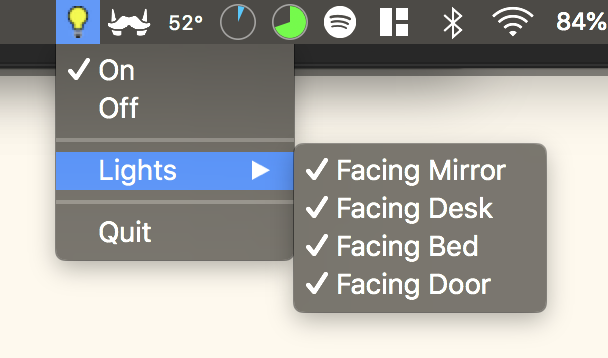
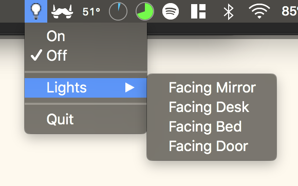

# Menu Light Bar

A Menubar app for Mac OS, allowing you to controll your Philips Hue Lights from the desktop. 

## Completed 

* Change the state of individual lights.
* Turn all lights on/off.
* See if lights are on/off from tray icon.

## Usage

* Download/fork repo
* cd to folder and run `npm install`
* Run `npm run start`

## Still to come

* Change scenes
* Potentially change brightness/colour etc
* Bug fixes